# Introduction to CSS3
##### (by Colleen van Lent, Ph.D. University of Michigan)

## Week 1

## Week One: Getting Started with Simple Styling

Welcome to Introduction to CSS3! In this course you will learn how to
style your pages by taking advantage of the power of CSS3. We will focus
on both proper syntax (how to write your styling rules) and the
importance of accessibility design (making sure that your style enhances
your site, not make it harder to navigate). It is so important that you
jump in ready to make mistakes and typos in this course. The only way
you will really understand the material is to practice typing it in on
your own as often as possible.

  i.  **Syllabus --** Introduction to CSS3 -- University of Michigan
  ii. **Reading:** Resources
  iii. **Reading:** Help us learn more about you!
  iv. **Reading:** Syllabus
  v.  **Reading:** Building Your First Web Page
  vi. **Reading:** Early coding
  vii. **Reading:** Code Placement

## Week 1

  1. [**Course Welcome**](https://www.coursera.org/lecture/introcss/01-01-course-welcome-zOHP0)
  2. Cascading Style Sheets
  3. Colors
  4. Styling Your Text
  5. Code Together
  6. Display and Visibility - Part 1
  7. Display and Visibility - Part 2

## Week 2

## Week Two: Advanced Styling

Colors and fonts are just the start to styling your page. The nice thing
about starting with these properties is that they are usually very
straightforward to implement. You pick a color and boom - instant,
expected results. This week we move on to new properties that tend to
require a little bit of tweaking to get the desired results. In
particular we will talk about the Box Model, background images, opacity,
float, columns, visibility, and designing for different browsers.

  1. [**Box Mode**](https://www.coursera.org/lecture/introcss/02-01-box-model-VDg21)
  2. **Video:** Code Together
  3. **Video:** Styling Links and Lists
  4. **Video:** Advanced Selectors
  5. **Video:** Browser Capabilites
  6. **Video:** Code Together
  7. **Video:** Designing For Accessibility

## Week 3

## Week Three: Psuedo-classes, Pseudo-elements, Transitions, and Positioning 

Have you ever noticed on a web page that some links are blue and others
are purple, depending upon if you have clicked on the links? How is it
possible to style some anchor tags and not others? This week you will
learn how to style pseudo-classes (e.g., a link that has been visiting,
an element that has the mouse hovering over it) and pseudo-elements
(e.g., the first-letter of a heading, the first line of a paragraph).
These elements are not difficult to style, but do require careful
coding. It is also the first step to adding simple animation to your
site. We end this week with the subject of positioning \-- how to get
elements to stick to a certain part of your page. Think about annoying
pop-up ads. How do the programmers get them to stay RIGHT IN THE MIDDLE
OF THE SCREEN despite the fact that you keep trying to scroll them away.

  1. [**Pseudo Classes and Elements**](https://www.coursera.org/lecture/introcss/03-01-pseudo-classes-and-elements-jE7LQ)
  2. **Video:** Transitions
  3. **Video:** Transforms
  4. **Video:** Code together - Transitions
  5. **Video:** Positioning

## Week 4

## Week Four: Putting It All Together

This week I am going to do some code review. I will show you how I used
pseudo-classes and pseudo-elements to style a table. Then I give you a
demonstration of three different navigation bars that utilize different
styling options. We will want to step back and talk about how these
different options may affect the accessibility of our site. The final
step to completing this course is the completion of the peer-graded
project. You will have the chance to demonstrate the ability to follow
styling guidelines while still putting your own personal touch on the
project. Just remember, you need to validate your work for proper syntax
and accessibility.

  1.  [**Styling Tables**](https://www.coursera.org/lecture/introcss/04-01-styling-tables-OGCjp)
  2.  **Video:** Creating Navigation Menus
  3.  **Video:** Accessible Navigation
  4.  **Video:** Creating Navigation Menus 2
  5.  **Video:** Creating Navigation Menus 3
  6.  **Video:**  Optional - Homework Description
  7. **Video:** Conclusion

### Where To Go from Here?

If you would like to do more now that you have finished this course, I
have a few recommendations. The most important thing is that you
continue to practice your skills and always have \"something\" that you
are working on.

  1.  **Reading:** Coursera Options
  2.  **Reading:** CodeAcademy - other badge tutorials
  3.  **Reading: Meetups**
  4.  **Reading:** Post-course Survey
  5.  **Reading:** Keep Learning with Michigan Online

## i. Syllabus

### Welcome

Welcome to Introduction to CSS3. CSS stands for Cascading Style Sheets,
a method of styling your HTML documents with various colors, fonts,
layouts, and spacing. But that is just the beginning. You can also do
some \"cool\" stuff such as creating transitions or adding animations.
There are so many things you can do with CSS, that we focus on the
following:

-   Rules and syntax (how to write CSS code)

-   Simple styling (fonts, colors, borders)

-   More styling (background images and opacity)

-   Positioning - how to get the different parts of your page to go
    where you want them to go

-   Pseudo-classes - styling things that aren\'t even there!

Throughout the entire course there will be an emphasis on the importance
of accessibility. Not only will you style your site, but you will test
it and other sites on the POUR accessibility principles to ensure that
your styling is enhancing your site, not putting up unseen roadblocks.

### How this course works:

This course assumes that you already know how to write HTML code and are
ready to style your pages. In each module you will be asked to do the
following:

### Watch video lectures:

The information has been broken down into pieces to help you learn the
material in the smallest chunks that still give you enough information
to do something with it. The goal is to give you the ability to listen
to these during any time you have. You will find that some of the videos
have material that makes sense to you at once. Sometimes you may want to
replay other videos to clarify the material.

### Change the video speed to one that works best for you:

You may find that you can speed the videos up and still retain the
information. On the other hand, my mom is always telling me I talk too
quickly\... so you may find that you prefer to slow the videos down. The
important thing is to find something that works well for you. Use the
in-­video quizzes to help you gauge how your learning is going.

### Code with video lectures:

Some of the videos are not traditional lectures, instead they are videos
where I demonstrate the concepts from an earlier lecture. I highly
recommend that you code along with me while you watch these videos.
***[The key to success in this course is in writing
code.]*** I put these videos in so that you have something
specific to practice. It is also a great way for you to see how often I
mess up when I am coding!!

### Read extra materials:

Each module will include reading material. It is impossible to learn
everything you need to learn just by listening to the lectures. There
are suggested readings to go along with this course. I also encourage
you to seek out other resources online. Anyone who wants to work with
technology needs to understand that it is important to update your
skills.

### Quizzes:

The first three modules will each have a graded quiz. These quizzes are
intended to reinforce your confidence in the material, not \"trick\"
you. As often as possible each question will be linked to a specific
lecture or reading. You can take the quizzes as many times as you like,
but there is a limit on how many times you can take each quiz in a
certain time period. Occasionally I include an ungraded quiz to help
students track their current progress and prepare them for the graded
quiz.

### Peer Graded Assignments:

There will be three peer graded assignments in this course: they are at
the end of Week One, Week, Two, and Week Four. You are actually ready to
start the final assessment by the end of the third week of class, I just
wanted to provide some examples to accompany the final project.

### Optional materials:

There will also be optional material provided in many of the modules.
These may range from links to recent articles to videos on pioneers in
the fields of design and accessibility. None of these materials will be
required for the quizzes, but rather provide additional ways for you to
branch out and learn more about the history of the field or the emerging
ideas.

### Communication:

Communication for this course is done via the Discussion boards. The
best way to utilize the discussion board is to search for your topic
before posting. If you can\'t find an answer, please try to post your
question to the appropriate week. The mentors and Course liaison do a
great job of helping people. And of course we rely on students to help
each other as well. If you want to contact me directly, I do check my
ColleenAtUMSI Twitter account. I can not respond to emails.

### Participation Strategies:

Engaged learning looks different for everybody. In this course, we hope
you will define your own measures of success and engage with the
material in a way that best suits your needs. We recognize and celebrate
the diverse ways learners engage in courses. As you go through this
course, we hope you will reflect on your unique skills, needs, and
aspirations, and engage in the course material in a way that aligns with
your own goals. While the course provides time estimates for completion,
you should feel empowered to engage in the material in whatever ways
make sense to you.

### Ground Rules:

We expect everyone to be mindful of what they say and its potential
impact on others. The goal is to have respectful discussions that do not
violate the community space created for these conversations. Here are
some productive ways to engage in this course: 

-   **Participate:** This is a community. Read what others have written
    and share your thoughts.

-   **Stay curious:** Learn from experts and each other by listening and
    asking questions, not making assumptions.

-   **Keep your passion positive:** When replying to a discussion forum
    post, respond with thoughts on what was said, not about the person
    who posted. Avoid using all caps, too many exclamation points, or
    aggressive language.

We expect all learners to abide by our full [Learner Engagement
Policy](https://docs.google.com/document/d/18Ucy-lT33FmkDDYdtxHEJ_nRytVLr_XGRVq2moAsPB4/edit).
We will specifically be monitoring this course for language that could
be considered inflammatory, incivil, racist, or otherwise unacceptable
for this learning space, and we will remove language deemed such.

*Please note that external study groups on applications like WhatsApp
are not affiliated or endorsed by the University of Michigan. We
strongly discourage joining external groups and instead recommend
interacting with your fellow learners within the platform.*

*Please express caution if you do join or post any personal information
in these forums or in these groups. These forums are publicly accessible
and any information you post may be collected, published, or used in an
exploitative manner (scams, etc).*

### Academic Honesty:

All submitted work should be your own and academic dishonesty is not
allowed. Academic dishonesty can be defined as:

-   Copying answers

-   Copying words, ideas, or other materials from another source without
    giving credit to the original author

-   Copying from your peers within the course

-   Employing or allowing another person to alter or revise your work,
    and then submitting the work as your own

### Course Support:

Questions and discussion of course material should take place within the
course itself. Please do not contact instructors or teaching assistants
off the platform, as responding to individual questions is virtually
impossible. We encourage you to direct your questions to \[forum\],
where your question might be answered by a fellow learner or one of our
course team members. For technical help please contact the [Coursera
Learner Help Center](https://learner.coursera.help/hc/en-us)/ [edX Help
Center](https://support.edx.org/hc/en-us)/ [FutureLearn
FAQs](https://about.futurelearn.com/about/faq?category=course-sign-up-and-completion)
support forums.

### Accessibility:

We are committed to developing accessible learning experiences for the
widest possible audience. We recognize that learners with disabilities
(including but not limited to visual impairments, hearing impairments,
cognitive disabilities, or motor disabilities) might need more specific
accessibility-related support to achieve learning goals in this course. 

Please use the [accessibility feedback
form](https://forms.gle/sxxDQvstDYJF9PtR6) to let us know about any
accessibility challenges such as urgent issues that keep you from making
progress in the course (e.g., missing or inadequate alt-text, captioning
errors).

### Diversity, Equity, Inclusion, and Justice:

**We welcome all learners to this course.** People like you are joining
from all over the world and we value this diversity. We strive to create
a community of mutual respect and trust, where people from all
backgrounds, identities and views are valued and heard without the
threat of bias, harassment, intimidation, or discrimination. We pay
attention to your feedback, how different types of learners experience
this course, and aim to make improvements so the course can best serve
everyone. We hope you enjoy learning about topics that are important to
you.

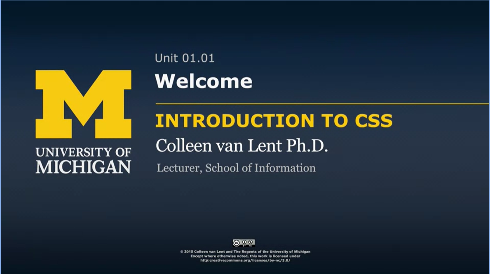
<!-- {width="4.0in" height="2.2440168416447945in"} -->

## Course Welcome/Overview

Hello, everybody. Welcome to Introduction to CSS3. In the next four
weeks, we\'re going to learn how to take plain simple HTML5 code and
turn it into something really beautiful.

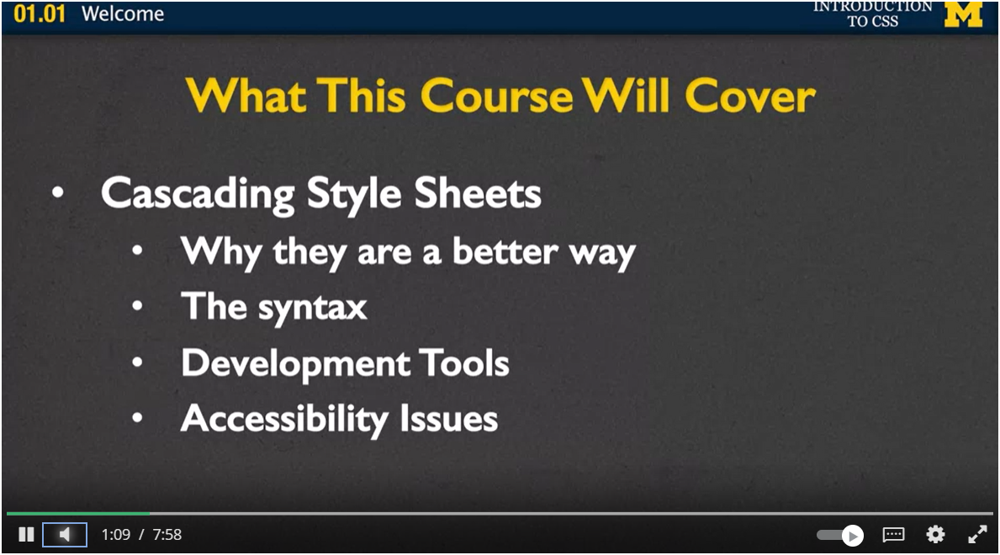
<!-- {width="4.0in" height="2.223503937007874in"} -->

What will be doing over the next four weeks? Well, the main focus will
be on learning about cascading style sheets. We\'re going to talk about
why they are a better way to style than what people used to use in the
early 2000\'s and late 1990\'s.

Next, you\'re going to learn the syntax. Once you know that it\'s a
better way to use it, how can we make sure that you\'re writing really
good code? Once you\'ve figured out the syntax, we\'ll go on and we\'ll
also talk about development tools.

When you do web design, it\'s very rare that you just sit there and you
code, and you don\'t look to the left, or look to the right, or go look
on the web. Instead, you\'re going to be using other tools to see how
you can change your code without actually having to write the code
beforehand.

Finally, as always, we\'ll be talking about accessibility issues. It\'s
always fun to add colors and animations and cool things to our page.
When we do that, we want to make sure that we don\'t do it at the cost
of accessibility. We want make sure everyone can see everything on our
page.

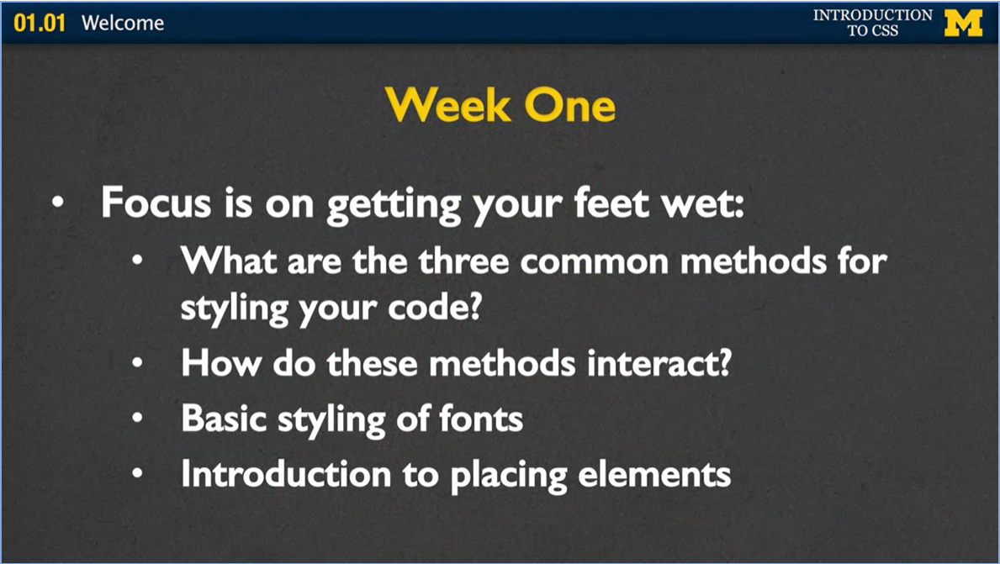
<!-- {width="4.0in" height="2.2572648731408576in"} -->

So, let\'s talk about what we\'re going to do on each of the four weeks.
In week one, the focus is really on just getting you started, getting
your feet wet and getting you a little bit of confidence in knowing that
you can do this.

We\'re going to start by talking about the three common methods for
styling code. And once we cover them, we\'re going to talk about how
these methods interact, which ones are better in different situations.
And different things that you can feel confident knowing how you can
best style your page in any specific situation.

Next, we\'ll talk about the basic styling of fonts. By the end of week
one, I really want you to be able to take a web page and change
something really obvious. Can you change the text so that it\'s cursive,
or underline, or a different color? Finally, we\'ll very briefly talk
about placing elements on the page. This is going to be an important
element of our entire four weeks. Is trying to figure out how you can
put your header over here or an image over there. And it can be tricky
but that\'s okay. Because we\'re going to repeat it week after week.

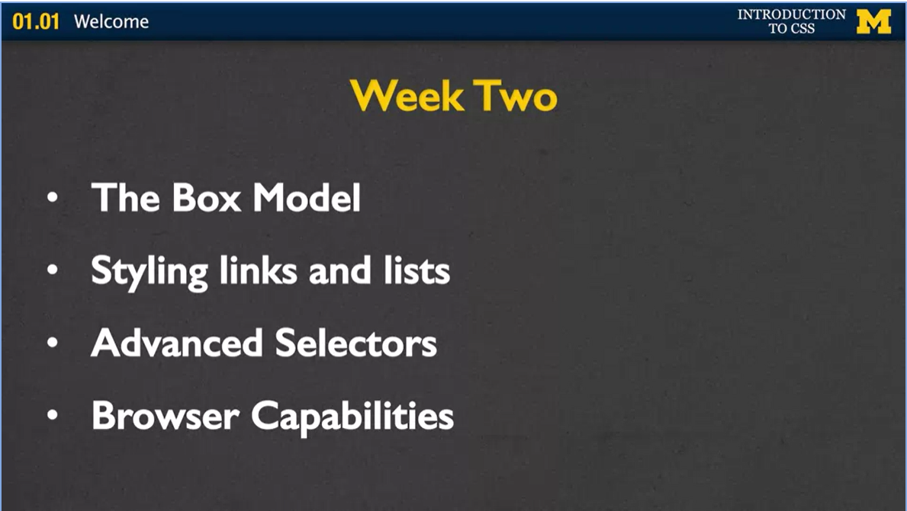
<!-- {width="4.0in" height="2.2572648731408576in"} -->

In week two, I\'ll talk about something called the box model. This is a
very common concept for any web developer, because we talk about how
every element on your page is actually a box. Next, we\'ll talk about
styling links and lists. We all love the links in our page. The web is
the web because we have links, so how can we make them look really cool?
Next, we\'ll talk about advanced selectors. In the beginning of the
course, we\'ll be very careful about styling simple elements such as
styling a list or styling a paragraph or styling a header. Next, we\'re
going to want to talk about what if we only want to style some of the
links, not all of the links? Finally, we\'ll talk about browser
capabilities. Just like when you learned about HTML5, you learned that
some browsers support some tags while others don\'t. In the same way,
browsers treat CSS differently. And I want you to know how to best react
to that.

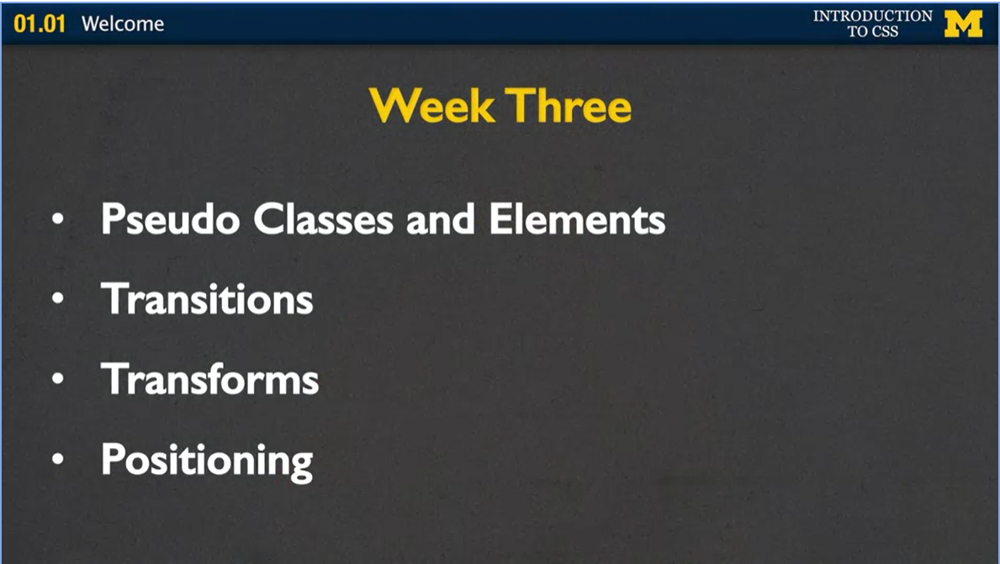
<!-- {width="4.0in" height="2.2572648731408576in"} -->

In week three, we talk about pseudo classes and elements. These are this
cool idea of how we can make different things happen when we hover over
a page. It also talks about how we can style just certain things like
the last paragraph in the page or the first paragraph. We\'ll also talk
about transitions. This is a way of changing the look of one of the
elements on your page, which is very similar to the idea of transforms.
Transforms are how we can rotate things on the page, skew them, making
them bigger and smaller, and doing different things like that. Finally,
again we\'ll talk about positioning, how we can make things go in a
certain spot and stay there all the time. We\'ve all seen really
annoying pop-up menus and different pop-up ads. Now you can make your
own annoying pop-up ad. In week four, we\'re not really going to cover
new material. Instead, it\'s going to be samples, samples, and more
examples and samples. In particular, I want to show you different ways
that we can style a table and different ways for styling a navigation
menu.

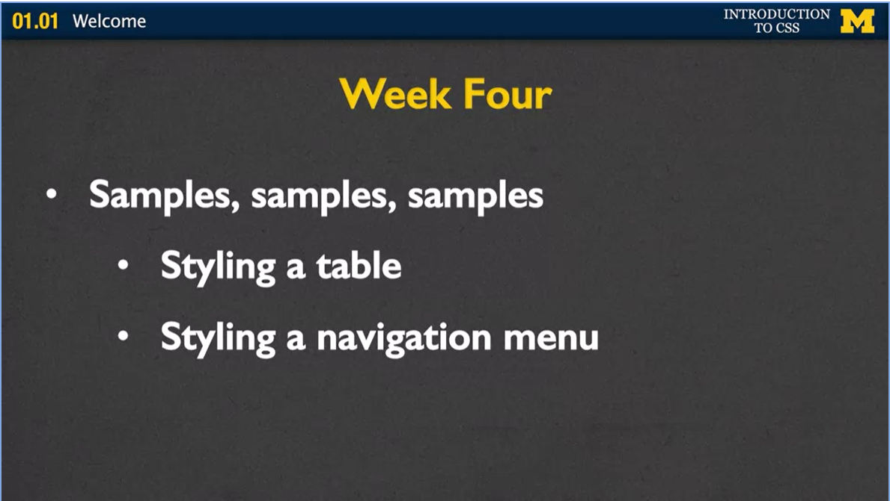
<!-- {width="4.0in" height="2.2572648731408576in"} -->

The bulk of week four will really be spent working on your final
project. So, I want you to know right off who this class is for and if
you\'re ready and are interested in taking it.

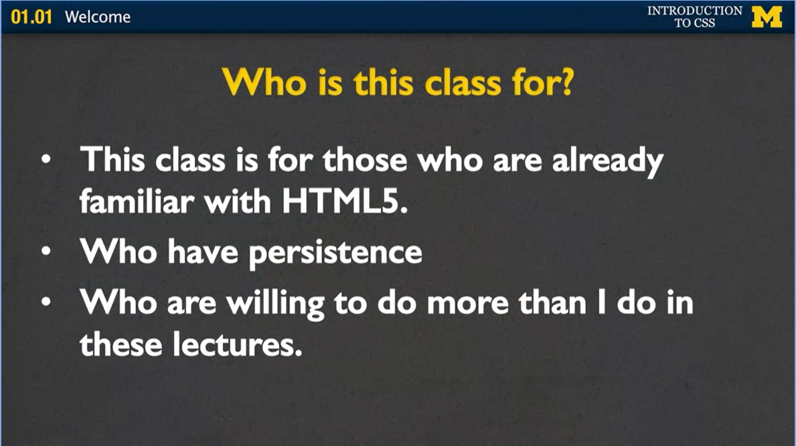
<!-- {width="4.0in" height="2.247435476815398in"} -->

First of all, you don\'t want to take this class unless you know about
HTML5 already. You may be taking a course on it. You may be just going
online and reading about it, but you need to feel comfortable if I
mention things such as tags or elements or validation. Next, this class
is for people who have persistence. You will never code your pages the
right way the first time. Even the second time, sometimes the third,
fourth, and fifth time. It\'s really about enjoying the whole process of
really wanting to get something to work and feeling little victories
when it does happen. Finally, this class is for those who are willing to
do more than what I\'m going to do in these lectures. There\'s only so
much information I can give to you. It\'s up to you to practice it,
tweak it, change it, and try to really see what happens beyond what I\'m
showing you.

So, if you want to know a little bit more about me and why I\'m choosing
to teach this class, here\'s a little bit of background information. I
have a PhD in Computer Science. But to be honest, that\'s really the
least important part. What I really have is two decades of teaching
experience. And during this time, I\'ve taught a wide range of students
and a wide range of topics. And I found that I really enjoy explaining
things in different ways, and I really enjoy reaching out to students
who maybe have more questions. My emphasis on education has always been
running around the classroom, helping students debug, meeting with them
one on one.

So, let\'s talk about how you can succeed in this course. In a perfect
world, you get together with friends, you\'d code together, you\'d learn
from each other's\' mistakes, and you\'d also learn from each other's\'
successes. While we don\'t have that one-on-one experience, make sure
you use the message boards. Not only to ask questions but to see what
other questions people are putting. You can learn a lot that way. I
really can\'t stress enough that I don\'t want you to feel like I\'m
trying to trick you, or that I\'m giving some sort of gotcha problems.
If you\'re ever working on something and you\'re stuck on it for more
than 15 minutes, move on. This is CSS, it\'s styling. There\'s always
something you can change, and you can find something else that you
prefer to work on.

Make sure that you\'re looking things up on your own. There\'s no way
I\'ll be able to teach you everything you need to know. And, that\'s why
you can go on the Internet and look at different resources, and see if
there\'s something out there that you would like to recreate.

Finally, it\'s really important that you practice this as much as you
can. If you do the minimum required for this course, and you\'re happy
with that, that\'s great. I\'m glad that you\'re able to learn
something. But if you really want to be a web developer, it\'s so
important that you\'re enjoying what you\'re doing, and you\'re going
off on your own, and you\'re creating something beautiful whenever you
can. So, I welcome you to the class, and I can\'t wait for you to join
us as we learn more about cascading style sheets. Thanks.

## Resources

### **Software**:

The **preferred** way to code in this class is editor software
(Notepad++, TextWrangler, Sublime, etc). If you do not have the ability
to access or install this type of software, there is an online editor
at:<http://www.w3schools.com/html/tryit.asp?filename=tryhtml_intro> .
You can also use CodePen (there is a link below). It is important that
you find a way that you can enter code and still test your work.

### **Code:**

All of the code I cover is available from a CodePen repository. I hope
you can play with the code to test the different concepts we will cover.
Here is a link to the CodePen repository for the Week One code.

<http://codepen.io/collection/noEQed/>

Here is a list of the lectures this week that use CodePen, and the name
of each file that they use:

### 01-02 Cascading Style Sheet:

-   styleAttribute.html

-   Presendence

-   externalstyle

-   internalStyle.html

### 01-04 Styling Your Text:

-   fonts

### 01-05 Code Together:

-   Code Together 1 - No CS

-   Code Together 1 - With CSS

### 01-06 Display and Visbility - Part 1:

-   Display Example 1

-   Display Example 2

### **Slides:**

If you would like to download a copy of slides, they are available here:

ZIP File

introcss.ppt

<https://d3c33hcgiwev3.cloudfront.net/_6fb69eabde5662fc69073f044056cafd_introcss.ppt.zip?Expires=1698364800&Signature=fuKkHBs6j5ODSGL6iSCuW3OBaKouKaSPVm8dDyDjEEKKbAUbcfaBfwgoHCE23MJ5yqYbvognEi3CARurOIZrS1qrEuFJUyKuo-6LMkWF~i-muSC66OGsgfD5e4kyK72sp8goyVsZIl6sIOtH5XMojMVXApZEG0h8B3viqAJa2Hg_&Key-Pair-Id=APKAJLTNE6QMUY6HBC5A>

## Building Your First Web Page by Shay Howe

This tutorial can be found at
<https://learn.shayhowe.com/html-css/building-your-first-web-page/>.
This is a great resource for a lot of my students. I particularly like
that the author uses CodePen. This is a great feature that lets you
open, edit, and run the code as you learn about it. The lesson
\"Building Your First Page\" gives a brief overview of HTML and the
structure of pages. I am going to assume you already know about that,
but it is a good refresher. The second part of this reading explains
many of the key terms that I will be using throughout this course.

You might find it easier to read through this after going through the
lectures. Or better yet, read this first, watch the lectures, and then
review the material again, but this time play with the code to see if
you can change the pages.

## Cascade Style Sheets

Hi. Welcome to our first truly technical lecture in our CSS course.
It\'s about adding style to your pages. If you\'ve come to this course
with me from our HTML course, you know that I know that you can make
general HTML files. But up until now, you may not have styled them at
all.

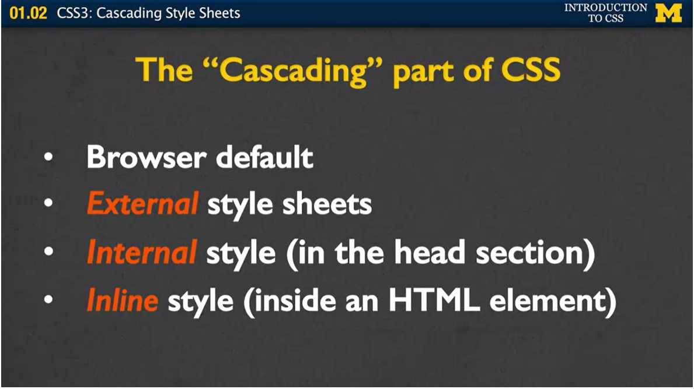
<!-- {width="4.0in" height="2.247435476815398in"} -->

What I want you to know before we even begin styling, and you start
putting your own little twists on the pages, is that the same HTML file
may look different when viewed on different browsers, and there\'s a few
reasons for that. First, some tags aren\'t supported in some browsers
while they are in others. If you\'ve ever used the details tag, you can
see that sometimes your page will have little arrows or different little
markings on them and other times it won\'t. That comes down to tags that
are supported. But also, every single browser has its own different
default style. And what that default style says is this is how I want my
H1 headings to look, or this is how much padding I want around my
paragraphs. If you go to the exact same page on different browsers, it
may be hard to tell, but you\'ll see tiny little differences in how
things are made. But in general, this default look is really plain. And
most people I know, they don\'t want their pages to look plain. They
want to put in some style. Let\'s begin looking at ways you can do this.
One way to add style is to think about adding it directly into the text.

Now as HTML evolved, we went from having tags that were distinctly about
color, and about different centering, and things like that. To saying
no, no, we don\'t want tags that have to do with style. We only want
tags that have to do with content. People said, okay, we can do that,
but I want to make it pretty. how they did this is they added style
attributes. In this case, I\'ve taken an h1 tag and added the style
attribute and simply said \"color:blue\". And what this is going to do
is it\'s going to make this particular h1 heading have blue font to it.
It\'s very simple. It\'s a nice way to just go in and add simple styling
to your page. However, this still kind of breaks our rule of wanting to
separate content from style. Because if you want to change it to, say,
red or green or something like that later, you\'re going to have to go
in and change the tag, because you\'re going to have to change the
attribute. I really tried to go out of my way to not use this at all,
and instead, get in the habit of doing things the right way. And the
right way to style your pages is to use CSS. Cascading style sheets are
basically a way for you to write rules that say how you want to style
all the paragraphs, or how you want to style all your headings, or how
you want to style some of your images. It\'s a really nice, specific way
that everyone can follow to make these styling choices. And the rules
are set up like this.

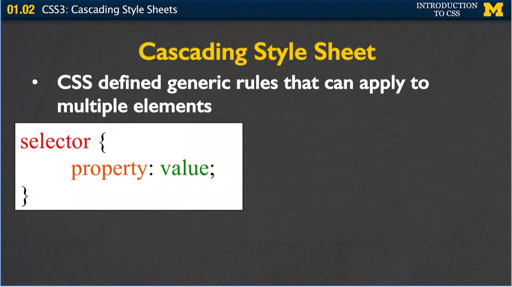
<!-- {width="4.0in" height="2.247435476815398in"} -->

First you have to put up your selector, and selector is just kind of a
fancy way of saying what it is you want to style. In our case, we\'ll
start off by just giving the selector different tag names such as h1 or
paragraph. Once you find which tag it is you want to style, you say
which property it is you want to change. We can look at things such as
color, background color, how much space we put around it, we\'re going
to cover all of those.

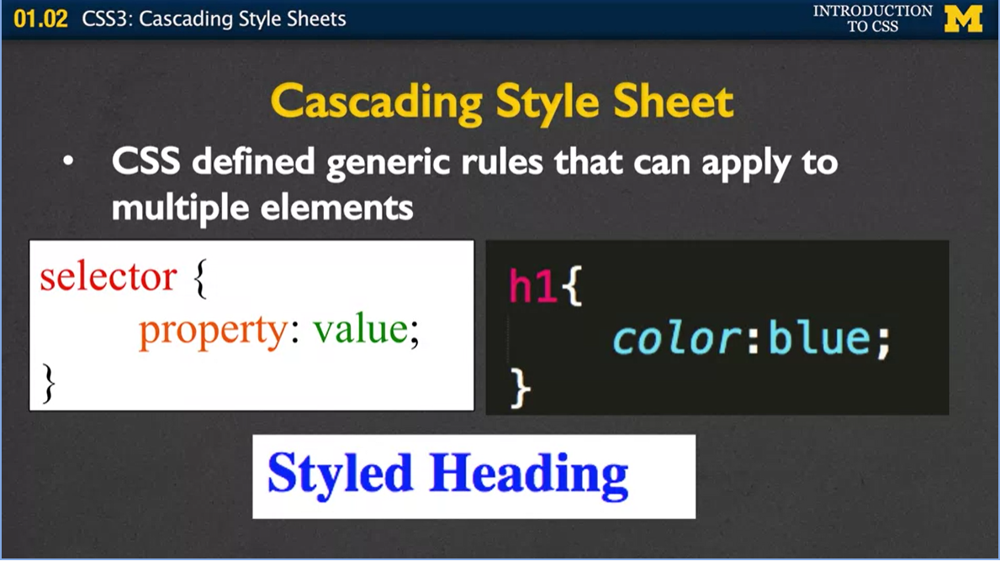
<!-- {width="4.0in" height="2.247435476815398in"} -->

But for right now, we\'re going to start off really simple and deal with
colors. Then, you have to give each property a value, saying which color
you want it to be. On one side, we have the very generic, how we write a
rule. And on the other, I\'ve written a very specific rule that says,
hey, whenever you see an h1 heading, I want you to make the font color
blue. We\'ve done exactly what we did when we embedded using the style
tag, but now it\'s very generic, and we\'re not talking about a specific
heading. We\'re not talking about a specific tag.

<!-- {width="4.0in" height="2.247435476815398in"} -->

When you write those rules, the syntax is very important. A lot of
times, when you write HTML, the browser is really nice to you and if you
forget to close a tag it says, that\'s okay, I know what she wants me to
do and it\'ll go ahead and put the page up anyway. When you\'re doing
CSS, if you\'re sloppy with what we call your syntax, you\'re going to
get in trouble. The brackets and the semicolons are very important. Let
me show you again when we go back here, you can see that I\'ve got a
beginning bracket and a closing bracket, and I\'ve got this semicolon
right at the end. You need to remember to include those.

<!-- {width="4.0in" height="2.247435476815398in"} -->

And one of the reasons I talk about this is that when you start writing
your code, when you pick a good editor, and most editors are pretty
good, such as Sublime or TextWrangler, TextEdit, Notepad++, they will
put colors in for you. So, all of a sudden if you\'re looking at your
CSS rules and you\'re like, woah, I kind of expected things to be
different colors, but instead everything\'s white or everything\'s red.
It kind of gives you this hint that you\'ve messed up on your rule
syntax. In the same line, I want to put comments in to help you debug
and explain to yourself what you\'re doing. This is how comments are
done in CSS. You just do the /\*, \*/ again. What happens if you want to
do more than just one property? What if instead of saying just you want
the color to be blue, you also want the background color to be yellow?
Well, no problem. You can have as many property value combinations as
you want. You just need to remember to separate them with semicolons.

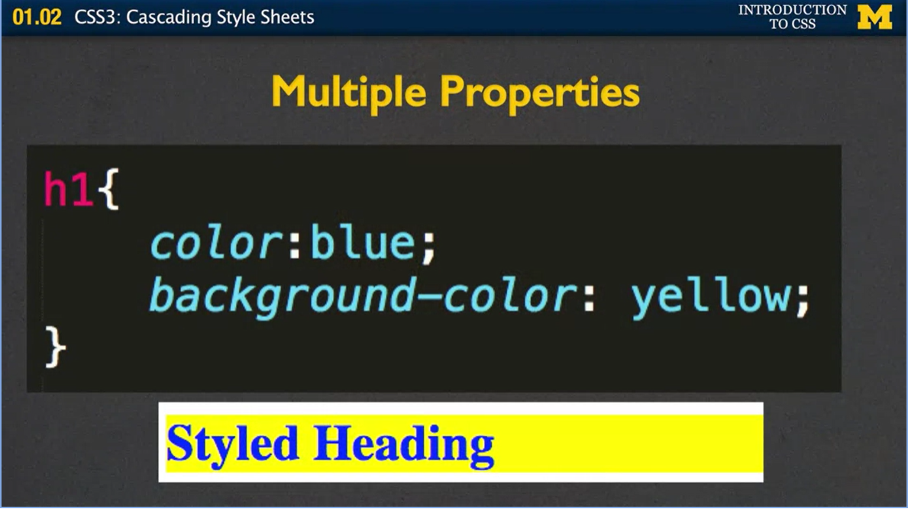
<!-- {width="6.5in" height="3.652083333333333in"} -->

In this case, again, I\'ve set the color to blue and the background
color to yellow.

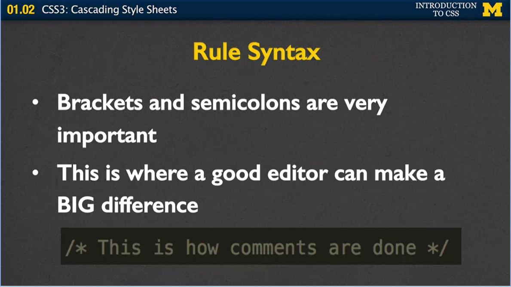
<!-- {width="4.0in" height="2.247435476815398in"} -->

All right so now that you know how to write a rule how do we actually
get them to work? There\'s two ways and the first way I\'m going to tell
you about is called using an Internal Style Sheet. As you can see over
here in my code, I\'ve got the basic template of our file. And inside
the head tags, I\'ve put this style tag in, that\'s where you\'re going
to want to put your rules, they\'re defined right within that style.

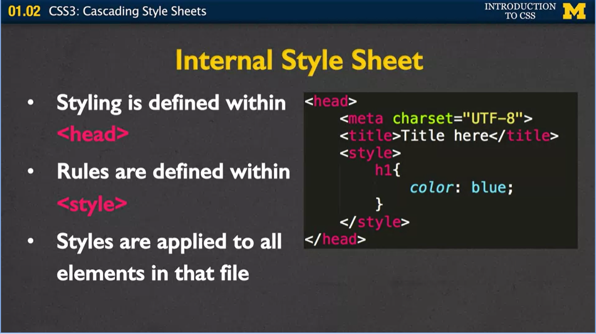
<!-- {width="4.0in" height="2.247435476815398in"} -->

Inside the style tag, I\'ve added the h1, the color blue, and I\'ve
ended my style tag. What happens now is that when the browser opens your
page, it gets to the head section it says, oh great, she wrote some
rules, let\'s see what she wants me to do. And it\'s going to know to go
through your page and apply this rule to all the H1 tags. And if you
have multiple rules including paragraphs, images, things like that,
it\'s going to know, I want to apply this to all instances in the entire
file.

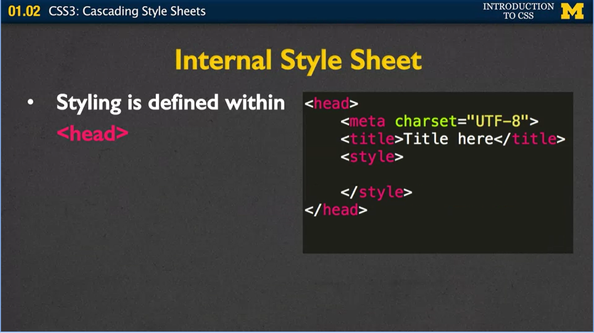
<!-- {width="4.0in" height="2.247435476815398in"} -->

There is a really good chance you\'re going to mess up because I do this
80% of the time when I\'m developing in class, and what I do is I forget
to close this style tag. And if you forget to close that style tag down
at the bottom, well actually your page may end up being blank. So don\'t
freak out when you first start doing this if your page is blank, it
probably means you forgot to close the style tag. All right. So,
internal style sheets are really nice when you\'re just trying to style
up one page. All right? And I often do it just so I can keep all my code
in one file instead of going back and forth and back and forth. Imagine
that you have site where you\'re going to have 10, 20, 1,000 different
pages and you want them all to have a very consistent look about them.
You don\'t want to have to go in and say if you want to change a color,
you don\'t want to have to go in and open every single one of those
files so you can change the color to red or green.

<!-- {width="4.0in" height="2.2440168416447945in"} -->

Instead, what you want to use is you want to use something called
external style sheets. The way it works with an external style sheet is
that you put your rules in a different file. You open up a file, you\'re
going to save it something such as like my style with a .css file
extension. Now the browser knows, oh everything in HTML, that\'s the
content. Everything in .css, that\'s the layout. When you make your
external style sheet, it looks just like we just did in the internal,
except for you don\'t use a style tag. Then, once you\'ve put your rules
in a separate file, all you need to do is add a link into the head
section. In this case, I\'ve gone in, I\'ve put my link, I need to let
it know the relationship because of the style sheet. And you have to
remember to put the file name. Once again this is where it\'s going to
be really important that you\'re naming things in ways that they make
since to you. You can link to as many different style sheets as you
want, most of the time we start with one.

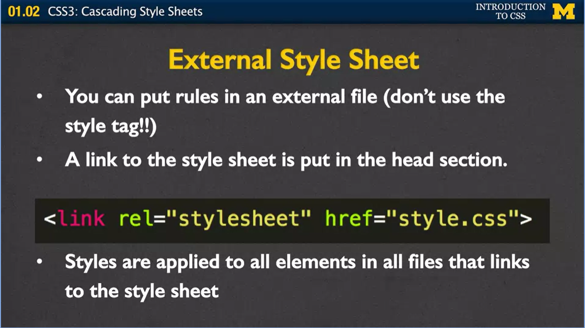
<!-- {width="4.0in" height="2.2440168416447945in"} -->

Now that we\'ve had that style sheet, every single file that links to it
will all share that style sheet. Remember when I mentioned that you
might have a site with 10, 20, 1,000 pages to it and you decide to
change that color from blue to red or green or something like that? This
is great. All you need to do is open up style.css, change one line of
code, and you\'ve now just changed potentially thousands of pages.

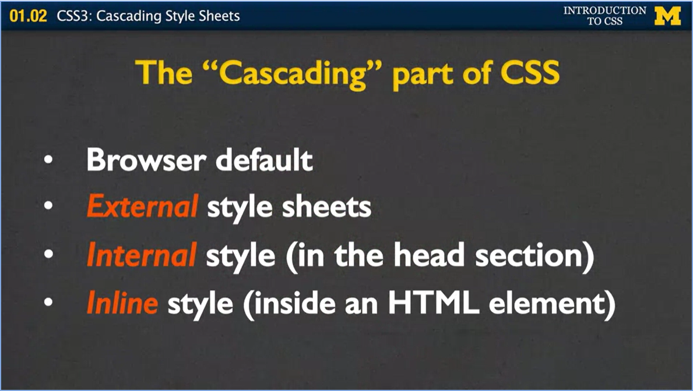
<!-- {width="4.0in" height="2.260683508311461in"} -->

Let\'s talk for a second about this idea of cascading style sheets. What
does it mean that we\'re cascading? Well, when the browser goes to make
your page, the first thing it\'s going to look at is go, all right,
maybe they\'re not telling me anything. How do I normally make h1
headings? How big do I make that font? Have its own kind of default
values. But then it goes and it looks and it says, oh are there any
external style sheets. Because if so, I\'m going to overwrite my browser
defaults and put in the rules that are in this external style sheet
instead.

Next, it\'s going to check for internal style. That style you have in
the head section. Because in general, the browser thinks, maybe there\'s
something really special about this particular page, and here she wants
me to do these rules instead.

Finally, any of those inline styles where you use the attribute tag,
those are going to have the highest precedence of all. It can be really
confusing, because you might start writing up different rules, and you
can\'t figure out why some are working and some aren\'t. This is where
the cascading part comes in again. First it looks at defaults, then
external, then internal, and then inline. Which is why really you want
to avoid using any inline style because it pretty much nullifies all
your styling rules.

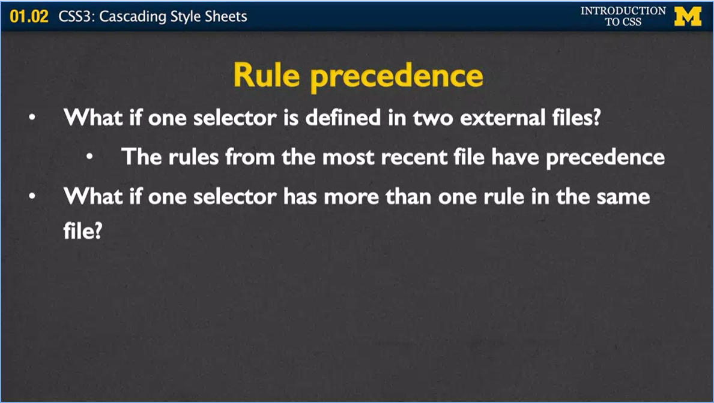
<!-- {width="4.0in" height="2.260683508311461in"} -->

Alright, so we know how those four go, but what if you have a selector
and, you\'ve linked to two or three different style sheets, and that
same H1 has been defined to be blue, green, and yellow, but in different
files. How does the browser know what to do? Well, how it works is that
the rules from the most recent file have precedence. And what I mean by
the most recent file, it means it goes up into the head section and it
goes one, two, three, and it kind of looks at what order you listed
them, and the last one you listed is the one that\'s going to have
precedence. Okay? Well, what if you have a selector in the same file,
and you\'ve written H1 multiple times. This can actually happen quite a
bit. Especially if you decide to go off and be part of a big development
company, you write some code, and then someone else writes some code,
or, as I tell my undergrads, maybe you went out and had a really good
time one night, and you came home and decided, I\'m going to code! And
you forget that you\'ve already written some rules. Well, if that\'s the
case, once again, the browser\'s going to look at the one it saw last.

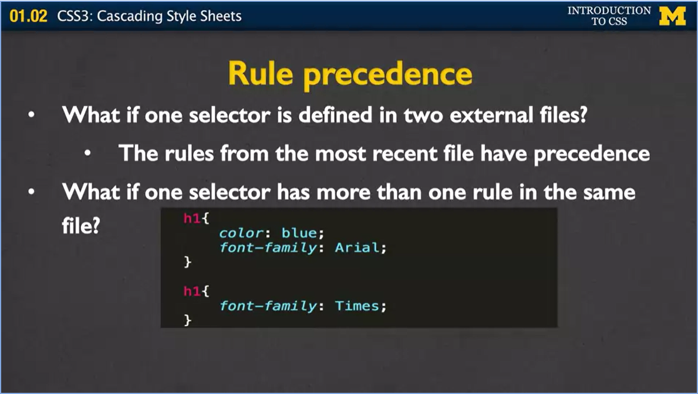
<!-- {width="4.0in" height="2.260683508311461in"} -->

So, in this case, I have two rules for h1. One writes at the color to
blue. And I said, hey I want you to use this aerial font family. And
then later, there might be a whole bunch of stuff in here, might be
nothing, and I say hey, I want you to use a font family Times. How the
browser\'s going to look at this is it\'s going to go down,
doo-doo-doo-doo-doo and say, I\'m going to make all the font blue, and
I\'m going to go ahead and make the font family Times. It\'s just always
is going to use the last one it saw. So again, the most recent rule has
precedence, whether it was inside your code or it came from different
files. There is, however, one way to overwrite this. Suppose you\'re
writing something and you know you want something to be that way. You
don\'t care if anyone else overwrites it. You really want to make sure
people aren\'t using inline style, different things like that. What you
can use is you can use the !important Attribute right here. Right here
I\'ve got font-family, Arial, and I\'ve got important right here. Even
though later I decide to overwrite it with times, the browser\'s going
to say nope, I know that she really wanted me to use Arial, and it works
out. Let\'s go ahead and look at an example of what I mean by all those
precedents. I know just listening to me can get a little overwhelming,
so I\'ve got a quick example showing you the different ways and then
I\'ll kind of wrap up this lecture. Let\'s start off using the style
attribute. As you can see in here, I\'ve written the code, and I\'ve
used the style attribute for this h1 heading, and this one paragraph. In
this case, I want my h1 heading to be blue, and my paragraph to be red.
And what I really wanna show you is that the only paragraph that was
changed to red text or red font was the first one. The other one\'s
still black. The only way to style is if you go in and you change each
and every tag to make it look the way you want it to. If I wanted all
the paragraphs to be red, I\'d have to go in there and put style equals,
style equals. In this example there\'s only two, but you can imagine how
it\'d get really annoying if you had a lot, okay. In our next example we
have an internal style. In this case, I\'ve put in my style tag up at
the top and I\'ve added rules for paragraphs and H1 headings, and it
should handle both. Now there\'s nothing in here anymore, my tag is all
by itself. And if you look at the result, let\'s go over here. You can
see that now, even though my HTML doesn\'t have any type of styling in
at all, both of the paragraphs are red over here and so\'s the heading.
All right? The last example I had for you is, I took these exact same
rules and I put them off into an external style sheet. Again, there\'s
no style tag here. It\'s just the rules themselves. And then I had to go
back to the HTML file, and you can see right up here, near the top, I have hey,
let\'s link to the style sheet I want. Now, I want to point this out
very carefully to you. If you notice, I have css/externalStyle sheet.
This means that my style sheet is in a special folder called css.
Developers really stress that you do this, because you want your code to
be kind of organized into different parts. Again, in the same way, I now
have a page that uses external style sheets and looks really good. All
this code is going to be available for you to look at it, but I want you
to kind of play with it as much as you can.

But I want to use this final example to help you understand how the
cascading works. Right here, I have my external style sheet. I\'m going
to go over here for just a second. Go to my, and I\'m going to add, One
last thing. Sorry, this is going to be awkward. And I\'m going to say
you know what? Instead, I want that font to be black again, and I end
it. I\'m going to show you what happens when you mess up really quickly.
I\'m going to save it; I\'m going to reload my page and everything
disappeared. This was what I was talking about. You really want to make
sure you include that style tag. Do it.

Make sure you close it up. All right. Now what I have going on here is
my browser has its browser default. It has an external style sheet, and
now it also has an internal one. Let\'s see what color it\'s going to
be, if it\'s going to be blue or if it\'s going to be black. And as you
can see, it\'s black. As you start styling, it\'s going to be very
important that you look at different ways for separating your content
from your formatting. As well as looking at the different ways that you
can do that formatting.

One of the first things I want you to think about is how this idea of
external and internal style sheets really plays into the separation of
content from formatting. And at the same time, I want you to understand
that we don\'t always follow every rule. In the beginning we always have
to start with really, really simple examples to help you guys solidify
what\'s going on with CSS. I\'m just going to end this now with a brief,
brief demo from an example they have at csszengarden.com because I think
it really brings home the idea that CSS can be very powerful. Let\'s
take a look. At this site, CSS Zen Garden, they\'ve actually done a
really great job of showing all the different ways you can format an
exact same file but in different ways. Up here, if you take a look, you
can see that this is one person\'s style sheet for decorating or styling
this document. Now, without changing any of the HTML at all, someone
else came in and said, hey, you know what, that\'s nice, but I\'m going
to style it this way. It looks completely different. It\'s the same
exact HTML but it looks completely different. In the same way, we\'ve
got this one right here, same exact HTML. But you couldn\'t look any
different, because they\'ve added some CSS and JavaScript to it that\'s
different. Come on with me. We\'re going to code a lot in this course.
We\'re going to be playing a lot with this course. You\'re going to be
messing up a lot in this course. But I can\'t wait for you to develop
something that really reflects how you want your page to look. Thanks.
